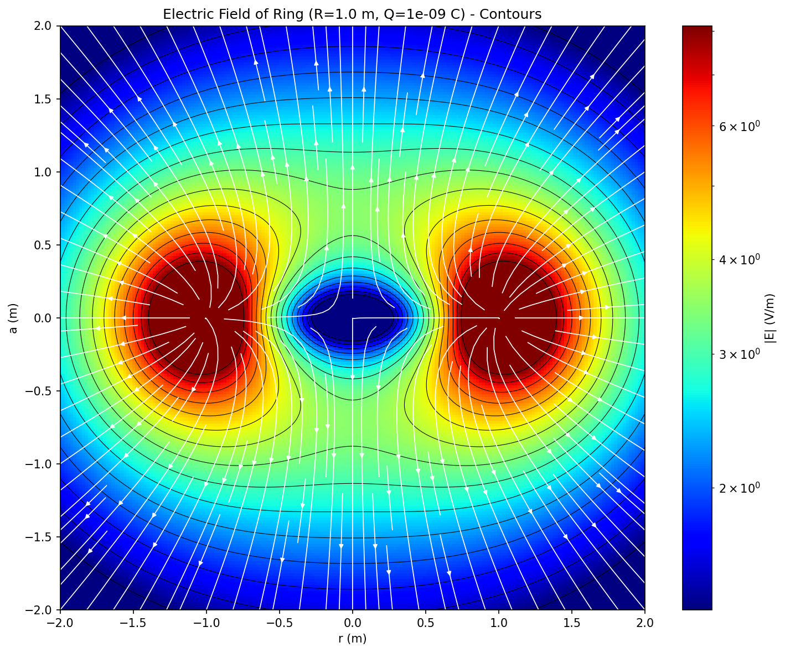
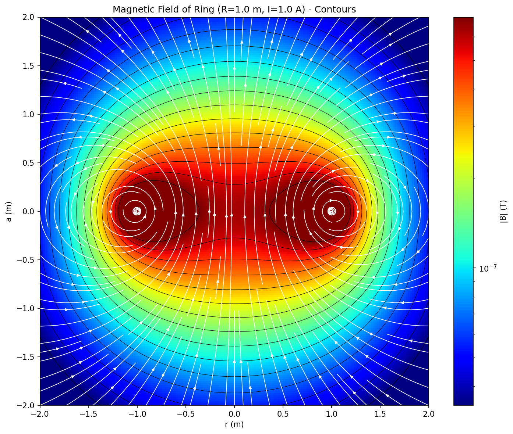

# mhfields

Maxwell-Heaviside Fields - a Python library for calculating the off-axis electric and magnetic fields of rings of charge and current.





## Installation

Install the required dependencies:

```bash
pip install -r requirements.txt
```

Or install them directly:

```bash
pip install numpy scipy matplotlib
```

## Usage

### Electric field of a ring of charge

```python
from mhfields import ring_electric_field, plot_field_2d

R = 1.0   # Ring radius (m)
Q = 1e-9  # Total charge (C)

# Compute field at a point (cylindrical coordinates)
r, a = 0.5, 0.3  # radial and axial distances
E_r, E_a = ring_electric_field(r, a, R, Q)

# Or use Cartesian coordinates
from mhfields import ring_electric_field_xyz
Ex, Ey, Ez = ring_electric_field_xyz(x, y, z, R, Q)
```

### Magnetic field of a ring of current

```python
from mhfields import ring_magnetic_field

R = 1.0  # Ring radius (m)
I = 1.0  # Current (A)

B_r, B_a = ring_magnetic_field(r, a, R, I)
```

### Visualization

```python
from mhfields import ring_magnetic_field, plot_field_2d

R = 1.0
I = 1.0

plot_field_2d(
    lambda r, a: ring_magnetic_field(r, a, R, I),
    r_range=(-2, 2),
    a_range=(-2, 2),
    mode='log_contour_quiver',
    title='Magnetic Field of Ring of Current'
)
```

## Running Tests

```bash
pytest mhfields/tests/
```

## Theory

The library implements off-axis field calculations using complete elliptic integrals. See [docs/efield_ring_of_charge.pdf](docs/efield_ring_of_charge.pdf) for the full derivation.

### Coordinate System

- Ring lies in the XY plane, centered at origin
- `r` = radial distance from Z axis
- `a` = axial distance (along Z axis)
- `R` = ring radius

### Parameters

$$q = r^2 + R^2 + a^2 + 2rR$$

$$\mu = \frac{4rR}{q}$$

### Electric Field of Ring of Charge

$$E_r = \frac{Q}{4\pi\varepsilon_0} \frac{2}{\pi q^{3/2}(1-\mu)} \frac{1}{\mu} \left[2RK(\sqrt{\mu})(1-\mu) - E(\sqrt{\mu})(2R - \mu(r+R))\right]$$

$$E_a = \frac{Q}{4\pi\varepsilon_0} \frac{2}{\pi q^{3/2}(1-\mu)} a \cdot E(\sqrt{\mu})$$

### Magnetic Field of Ring of Current

$$B_r = \frac{\mu_0}{4\pi} I \frac{2}{\sqrt{q}} \frac{a}{r} \left[ E(\sqrt{\mu}) \frac{q - 2rR}{q - 4rR} - K(\sqrt{\mu}) \right]$$

$$B_a = \frac{\mu_0}{4\pi} I \frac{2}{\sqrt{q}} \left[ E(\sqrt{\mu}) \frac{R^2 - r^2 - a^2}{q - 4rR} + K(\sqrt{\mu}) \right]$$

Where $K(\sqrt{\mu})$ and $E(\sqrt{\mu})$ are the complete elliptic integrals of the first and second kind.

## Octave Implementation

An equivalent implementation in GNU Octave is available in the [octave/](octave/) directory, providing magnetic field calculations and visualization.

## References

- "Off-axis electric field of a ring of charge" by Indrek Mandre, July 2007 ([PDF](docs/efield_ring_of_charge.pdf))
